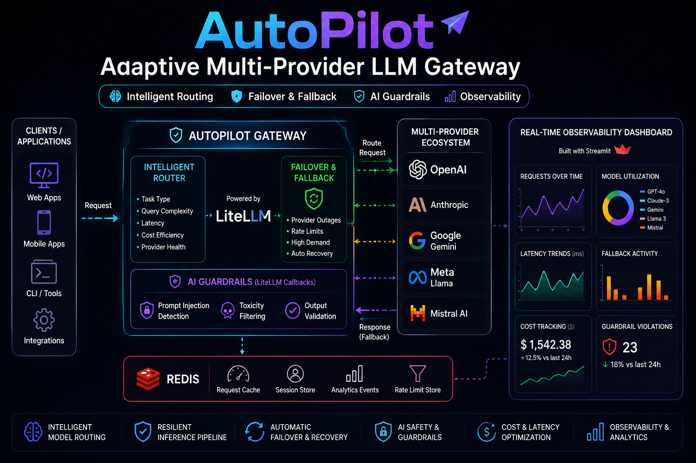

# AutoPilot : Adaptive Multi-Provider LLM Gateway

AutoPilot is a resilient multi-provider LLM gateway designed to intelligently orchestrate AI inference across multiple model providers using LiteLLM.  
The platform dynamically routes requests based on task type, query complexity, latency, and cost efficiency while supporting automatic failover and fallback recovery during outages, rate limits, and high-demand scenarios.  
It also integrates production-grade AI guardrails and real-time observability dashboards for reliable and safe AI infrastructure management.


---

## System Architecture

<p align="center">
  <!-- <a href="assets/demo/autopilot_demo.mp4"> -->
    
  <!-- </a> -->
</p>


---

## ✨ Features

- 🔀 **Adaptive Multi-Provider Routing**  
  Dynamically selects the optimal LLM provider based on:
  - query complexity
  - task type
  - latency
  - cost efficiency
  - provider health

- ⚡ **Automatic Failover & Recovery**  
  Seamlessly switches providers during:
  - outages
  - rate limits
  - API failures
  - high-demand spikes

- 🧠 **LiteLLM-Based Orchestration**  
  Unified interface for managing multiple LLM providers.

- 🛡️ **AI Guardrails**  
  Includes:
  - prompt injection detection
  - toxicity filtering
  - unsafe output validation

- 📊 **Real-Time Observability Dashboard**  
  Tracks:
  - request analytics
  - model utilization
  - latency metrics
  - fallback activity
  - cost monitoring
  - guardrail violations

- 🧵 **Redis-Powered Telemetry Layer**
  Stores real-time analytics and request metrics.


---

## 🛠️ Tech Stack

| Component              | Technology Used              |
|------------------------|------------------------------|
| 🐍 Programming         | Python                       |
| 🤖 LLM Gateway         | LiteLLM                      |
| 🧠 LLM Providers       | Groq + Gemini (Extensible to Any Provider) |
| 🔗 Orchestration       | LiteLLM Routing + Callbacks  |
| 🗄️ Analytics Store     | Redis                        |
| 🌐 Dashboard           | Streamlit                    |
| 🛡️ AI Safety          |  Guardrails           |
| 🐳 Containerization    | Docker (Redis only)          |

---

## ✨ Provider Flexibility

AutoPilot currently integrates:

- ⚡ **Groq**
- 🌟 **Google Gemini**

The gateway is fully extensible and allows users to easily integrate additional providers supported by LiteLLM, including:

- OpenAI
- Anthropic
- Cohere
- Mistral
- Together AI
- Azure OpenAI
- Ollama
- Local LLMs

Simply add provider API keys and routing configurations to extend the system.

---

## 📊 Dashboard Pages

AutoPilot provides two dedicated real-time observability dashboards built with Streamlit and Redis.

---

# 📈 Analytics Dashboard

The Analytics Dashboard provides complete inference and infrastructure monitoring.

<!-- <p align="center">
  
</p> -->

### 🔍 Metrics Tracked

- 📨 Total Requests
- ⏱️ Average Latency
- 💰 Total Cost Tracking
- 🔁 Fallback Count
- 🤖 Model Usage Distribution
- 📈 Latency Trend Analysis
- 📝 Request History Logs

This dashboard helps monitor:
- provider performance
- routing efficiency
- infrastructure health
- operational cost trends

---

# 🛡️ Guardrails Dashboard

The Guardrails Dashboard focuses on AI safety and security monitoring.

<!-- <p align="center">
  
</p> -->

### 🚨 Guardrail Metrics

- ⚠️ Total Violations
- 🧪 Violation Type Distribution
- 📜 Detailed Violation Logs

This dashboard helps detect:
- prompt injection attempts
- toxic prompts
- unsafe outputs

---


## ⚙️ Installation & Setup (Using pip)

1. 📥 Clone the repository:
   ```bash
   git clone https://github.com/Sameer078/AutoPilot
   cd AutoPilot
   ```

2. 🧪 Create and activate a virtual environment:
   ```bash
   python -m venv venv
   source venv/bin/activate
   ```
   On Windows:
   ```bash
   venv\Scripts\activate
   ```

3. 📦 Install dependencies:
   ```bash
   pip install -r requirements.txt
   ```

4. 🔑 Set environment variables:
   ```bash
   export GROQ_API_KEY="your_groq_key"
   export GEMINI_API_KEY="your_google_key"
   export REDIS_HOST="localhost"
   export REDIS_PORT="6379"
   ```
   On Windows:
   ```bash
   set GROQ_API_KEY=your_groq_key
   set GEMINI_API_KEY=your_google_key
   set REDIS_HOST=localhost
   set REDIS_PORT=6379
   ```

---

## ⚡ Installation & Setup (Using uv)

`uv` is a fast Python package and environment manager.

1. 📥 Clone the repository:
   ```bash
   git clone https://github.com/Sameer078/AutoPilot
   cd AutoPilot
   ```

2. 📦 Initialize the project:
   ```bash
   uv init .
   ```

3. 🧪 Create a virtual environment:
   ```bash
   uv venv
   ```

4. ▶️ Activate the virtual environment:
   ```bash
   .venv/Scripts/activate
   ```
   On macOS/Linux:
   ```bash
   source .venv/bin/activate
   ```

5. 📦 Install dependencies:
   ```bash
   uv add -r requirements.txt
   ```

6. 🔑 Set environment variables:
   ```bash
   export GROQ_API_KEY="your_groq_key"
   export GEMINI_API_KEY="your_google_key"
   export REDIS_HOST="localhost"
   export REDIS_PORT="6379"
   ```
   On Windows:
   ```bash
   set GROQ_API_KEY=your_groq_key
   set GEMINI_API_KEY=your_google_key
   set REDIS_HOST=localhost
   set REDIS_PORT=6379
   ```

---

## 🐳 Running Redis Container

Start Redis using Docker:

```bash
docker run -p 6379:6379 redis
```

This launches a Redis container locally for:
- request telemetry
- analytics storage
- observability metrics
- caching

---

## ▶️ How to Run the Project


### 🌐 Start the Streamlit Dashboard

```bash
streamlit run app.py
```

---


## 🧑‍💻 Usage Example

1. 📨 User sends a request to the gateway  
2. 🧠 Routing engine selects the optimal provider  
3. 🛡️ Guardrails validate prompts and outputs  
4. ⚡ LiteLLM forwards inference requests  
5. 🔁 Automatic failover occurs if provider fails  
6. 📊 Metrics are stored in Redis  
7. 🌐 Streamlit dashboard visualizes real-time system behavior  


---

## 📜 License

This project is licensed under the **MIT License**.
